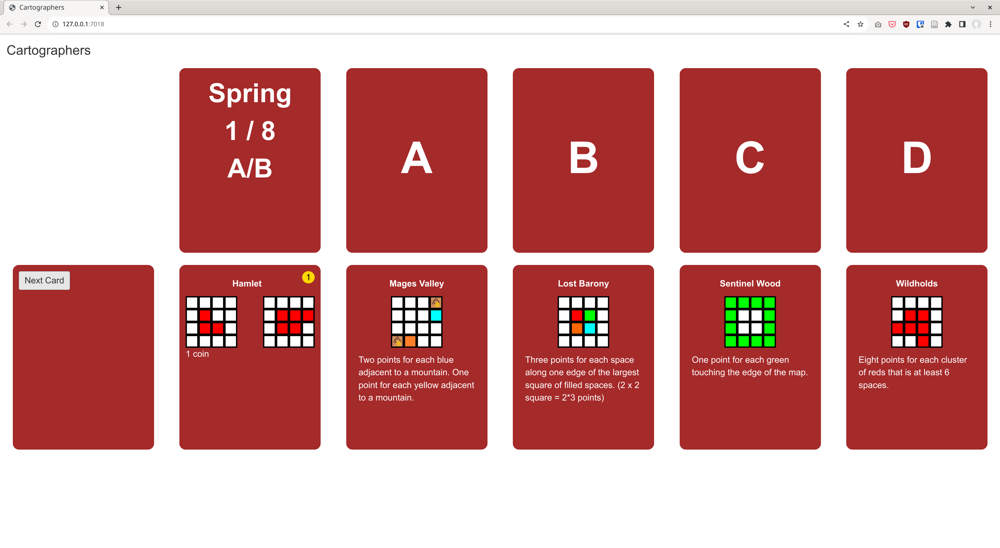

# Cartographers as Shiny App

Implementation of [Cartographers](https://www.thunderworksgames.com/cartographers.html) board game as R Shiny App.



## Test

We recommend you to use Docker Compose to test it.
Run

```
$ docker-compose up
```

and open http://localhost:3030/ with your web browser.